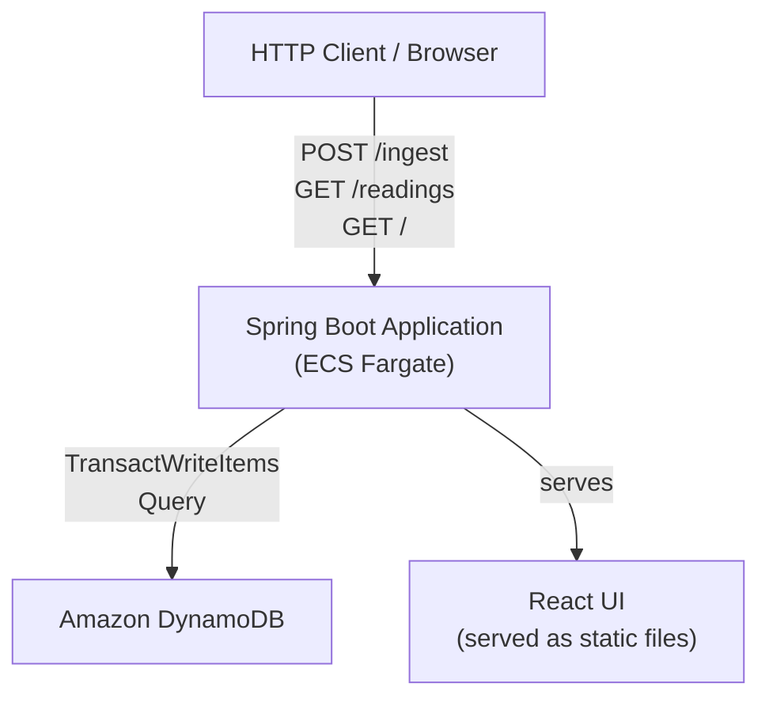
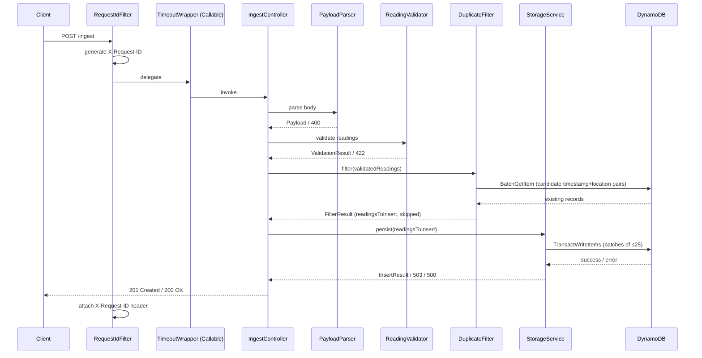
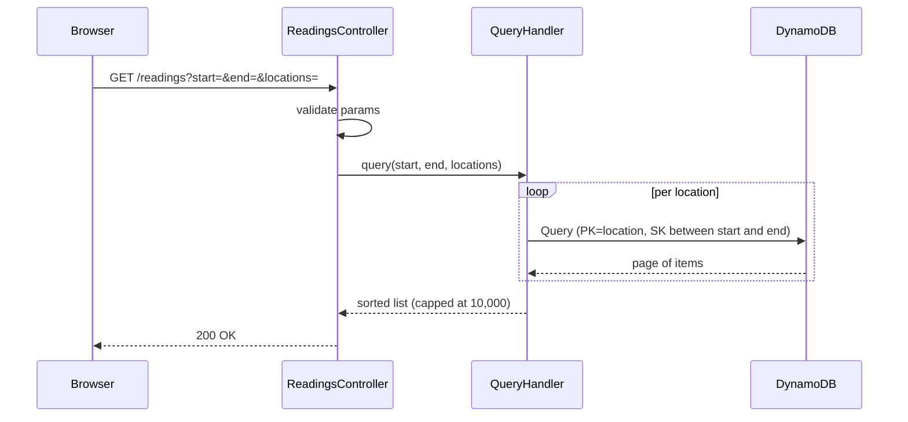

# Design Document: json-http-ingestion

## Overview

The hygrometer data service is a Spring Boot application that accepts batched JSON payloads of temperature and humidity readings via HTTP POST, validates and persists each reading as an individual DynamoDB record, exposes a time-range/location query API, and serves a React-based browser UI for visualizing trends.

The service is a single deployable unit: the Spring Boot JAR serves both the REST API and the pre-built React frontend as static files. It is containerized and deployed to AWS ECS on Fargate, with DynamoDB as the sole persistence backend.

### Key Design Decisions

- **DynamoDB table key design**: `location` (String) as partition key, `timestamp` (String, ISO 8601) as sort key. ISO 8601 timestamps sort lexicographically, enabling efficient range queries per location without a GSI. A `request_id` attribute (UUID v4) provides per-record traceability.
- **Atomicity via TransactWriteItems**: DynamoDB `TransactWriteItems` provides all-or-nothing semantics for up to 25 items per call. Payloads with more than 25 readings are split into sequential transactions; if any transaction fails, previously committed transactions are compensated by deleting their inserted items.
- **Request timeout via Spring MVC `Callable`**: Controller methods return `Callable<ResponseEntity<?>>`, enabling Spring's `spring.mvc.async.request-timeout` to enforce the configurable timeout and return HTTP 408 automatically.
- **Validation before persistence**: All readings in a payload are validated in full before any DynamoDB write is attempted, so partial-write scenarios are avoided at the application layer.
- **No ORM**: All DynamoDB access uses the AWS SDK for Java v2 Enhanced Client (`DynamoDbEnhancedClient`) with annotated bean classes. No JPA/Hibernate.

---

## Architecture



### Request Flow — Ingestion



### Request Flow — Query



---

## Components and Interfaces

### Spring Boot Application Entry Point

`HygrometerApplication` — standard `@SpringBootApplication` main class. Reads and validates all environment variables at startup via a `@Configuration` class (`AppConfig`); logs an error and calls `System.exit(1)` if any required variable is missing or invalid.

### RequestIdFilter

A `javax.servlet.Filter` (registered as a Spring `@Component`) that runs on every request except the health-check path:

- Generates a UUID v4 per request and stores it in `MDC` (for log correlation) and in a request-scoped holder.
- Attaches the UUID as `X-Request-ID` to every response before it is committed.
- Excluded from health-check responses per Requirement 5.4.

### IngestController

`@RestController` mapped to `POST ${app.ingest-path}` (default `/ingest`).

- Returns `Callable<ResponseEntity<?>>` so Spring MVC's async timeout applies.
- Delegates to `PayloadParser`, `ReadingValidator`, `DuplicateFilter`, and `StorageService` in sequence.
- After `DuplicateFilter` returns a `FilterResult`, passes `readingsToInsert` to `StorageService`.
- Builds the success response using `inserted_count` and `request_ids` from `InsertResult`, and `skipped_count` and `skipped` from `FilterResult`.
- Returns HTTP 201 if `inserted_count > 0`; returns HTTP 200 if `inserted_count == 0` (all readings were duplicates).
- Catches `DatabaseUnavailableException` → 503; `DatabaseConstraintException` → 500; all other unchecked exceptions are handled by `GlobalExceptionHandler`.

```java
@PostMapping(
    value = "${app.ingest-path:/ingest}",
    consumes = MediaType.APPLICATION_JSON_VALUE,
    produces = MediaType.APPLICATION_JSON_VALUE
)
public Callable<ResponseEntity<?>> ingest(@RequestBody(required = false) String rawBody,
                                          HttpServletRequest request) { ... }
```

### DuplicateFilter

Spring `@Service` that sits between `ReadingValidator` and `StorageService` in the ingestion pipeline.

Responsibilities:
- Accept the validated list of `HygrometerReading` objects.
- **Intra-batch duplicate detection**: scan the list for readings that share the same `timestamp` + `location` as an earlier reading in the same batch. Log a WARNING for each duplicate after the first occurrence; keep only the first occurrence as the candidate for insertion. All subsequent intra-batch duplicates are added to the skipped list with reason `"conflicting_data"` (intra-batch duplicates always warn, regardless of whether field values are identical).
- **Inter-batch duplicate detection**: use `DynamoDbEnhancedClient.batchGetItem()` to fetch existing records for all candidate `(location, timestamp)` pairs in a single round-trip (or multiple round-trips if there are more than 100 candidate keys, since DynamoDB `BatchGetItem` is limited to 100 items per call).
  - If a candidate matches an existing record and `temperature_f` and `humidity_pct` are identical → silent skip, reason `"exact_match"`.
  - If a candidate matches an existing record and any value differs → skip and log a WARNING, reason `"conflicting_data"`.
- Return a `FilterResult` containing the list of non-duplicate `HygrometerReading` objects to persist and a list of `SkippedReading` descriptors.

```java
@Service
public class DuplicateFilter {
    FilterResult filter(List<HygrometerReading> readings) { ... }
}
```

### ReadingsController

`@RestController` mapped to `GET ${app.readings-path}` (default `/readings`).

- Returns `Callable<ResponseEntity<?>>` for timeout support.
- Validates `start`, `end`, and `locations` query parameters.
- Delegates to `QueryHandler`.

### HealthController

`@RestController` mapped to `GET /health` — returns `200 OK` with `{"status":"ok"}`. No `X-Request-ID` header.

### PayloadParser

Plain Spring `@Service`. Accepts the raw request body string and produces a `Payload` record or throws a typed `ParseException`.

Responsibilities:
- Reject empty body → 400.
- Parse JSON using Jackson `ObjectMapper`; catch `JsonProcessingException` → 400 with parse error detail.
- Assert top-level value is an object → 400.
- Assert `readings` key exists and is an array → 400.
- Assert `readings` array is non-empty → 400.

### ReadingValidator

Plain Spring `@Service`. Accepts a `Payload` and returns a `ValidationResult` (either `valid` with a list of `HygrometerReading` objects, or `invalid` with a list of `ValidationFailure` records).

Validates each item in the `readings` array:
- Item is a JSON object.
- `timestamp`: present, string, RFC 3339 parseable via `OffsetDateTime.parse()`.
- `temperature_f`: present, numeric, in [-999, 999].
- `humidity_pct`: present, numeric, in [0, 100].
- `location`: present, non-empty string, 1–255 characters.

All failures are collected before returning (no fail-fast), so the 422 response lists every problem.

### StorageService

Spring `@Service` that wraps `DynamoDbEnhancedClient`.

- Accepts the list of non-duplicate `HygrometerReading` objects produced by `DuplicateFilter` (duplicate filtering has already been applied before this service is called).
- Assigns a UUID v4 `request_id` and a UTC ingestion timestamp to each.
- Splits the list into batches of ≤ 25 and calls `transactWriteItems` for each batch. Atomicity applies to this non-duplicate subset: either all non-duplicate records are inserted or none are.
- On failure of any batch, attempts compensating deletes for already-committed batches (best-effort; logs any compensation failure). The client must retransmit the entire payload if this occurs.
- Returns an `InsertResult` containing the ordered list of `request_id` values.
- Throws `DatabaseUnavailableException` on connection errors, `DatabaseConstraintException` on constraint violations.

### QueryHandler

Spring `@Service` that wraps `DynamoDbEnhancedClient`.

- Accepts `start` (OffsetDateTime), `end` (OffsetDateTime), and `locations` (List<String>).
- Issues one DynamoDB `Query` per location (PK = location, SK between ISO 8601 start and end strings, inclusive).
- Merges results from all locations, sorts by timestamp ascending.
- Caps at 10,000 records; sets `truncated = true` if the raw result count exceeded the cap.
- Throws `DatabaseUnavailableException` on connection errors.

### GlobalExceptionHandler

`@RestControllerAdvice` that catches:
- `AsyncRequestTimeoutException` → 408 with error body.
- `HttpMediaTypeNotSupportedException` → 415.
- `HttpRequestMethodNotSupportedException` → 405.
- `MethodArgumentNotValidException` → 422.
- All other `Throwable` → 500 with sanitized message (no stack trace, no class names).

Logs full stack trace + `X-Request-ID` for every 5xx response.

### AppConfig

`@Configuration` class that:
- Reads `DATABASE_URL`, `PORT`, `MAX_PAYLOAD_BYTES`, `REQUEST_TIMEOUT_SECONDS` from environment.
- Validates ranges and types; logs descriptive errors and exits on failure.
- Produces `DynamoDbClient`, `DynamoDbEnhancedClient`, and `DynamoDbTable<ReadingItem>` beans.
- Sets `spring.mvc.async.request-timeout` programmatically from `REQUEST_TIMEOUT_SECONDS`.

---

## Data Models

### DynamoDB Table: `hygrometer_readings`

| Attribute | Type | Role |
|---|---|---|
| `location` | String (S) | Partition key |
| `timestamp` | String (S) | Sort key (ISO 8601, lexicographic sort) |
| `request_id` | String (S) | UUID v4, per-record traceability |
| `temperature_f` | Number (N) | Temperature in °F |
| `humidity_pct` | Number (N) | Relative humidity % |
| `ingested_at` | String (S) | UTC ingestion time, ISO 8601 ms precision |

No GSI is required. Queries filter by `location` (PK) and `timestamp` range (SK), which is the native DynamoDB access pattern.

**Rationale for key design**: The primary query pattern is "all readings for location X between time A and time B." Using `location` as the partition key and `timestamp` as the sort key maps directly to a DynamoDB `Query` with a `KeyConditionExpression` of `location = :loc AND #ts BETWEEN :start AND :end`. ISO 8601 strings with timezone offset sort correctly as strings when all timestamps are normalized to UTC before storage.

### Java Bean: `ReadingItem` (DynamoDB Enhanced Client mapping)

```java
@DynamoDbBean
public class ReadingItem {
    @DynamoDbPartitionKey
    private String location;

    @DynamoDbSortKey
    private String timestamp;          // stored as UTC ISO 8601

    private String requestId;
    private BigDecimal temperatureF;
    private BigDecimal humidityPct;
    private String ingestedAt;         // UTC ISO 8601 with ms precision
}
```

### Java Record: `HygrometerReading` (in-memory, post-validation)

```java
public record HygrometerReading(
    OffsetDateTime timestamp,
    BigDecimal temperatureF,
    BigDecimal humidityPct,
    String location
) {}
```

### Java Record: `SkippedReading`

```java
public record SkippedReading(int index, String reason) {}
```

`reason` is either `"exact_match"` (identical inter-batch duplicate) or `"conflicting_data"` (conflicting inter-batch duplicate or any intra-batch duplicate).

### Java Record: `FilterResult`

```java
public record FilterResult(
    List<HygrometerReading> readingsToInsert,
    List<SkippedReading> skipped
) {}
```

### API Response: Success (201 Created — at least one record inserted)

```json
{
  "status": "success",
  "inserted_count": 2,
  "skipped_count": 1,
  "skipped": [
    { "index": 1, "reason": "exact_match" }
  ],
  "request_ids": [
    "a1b2c3d4-...",
    "c9d0e1f2-..."
  ]
}
```

`skipped` is omitted from the response when empty. `inserted_count + skipped_count` always equals the total number of readings submitted.

### API Response: Success (200 OK — all readings were duplicates)

```json
{
  "status": "success",
  "inserted_count": 0,
  "skipped_count": 3,
  "skipped": [
    { "index": 0, "reason": "exact_match" },
    { "index": 1, "reason": "conflicting_data" },
    { "index": 2, "reason": "exact_match" }
  ]
}
```

### API Response: Error

```json
{
  "status": "error",
  "error": "INVALID_PAYLOAD",
  "message": "readings[1].temperature_f: value 1200.0 is outside valid range [-999, 999]"
}
```

### API Response: Query (200 OK)

```json
{
  "readings": [
    {
      "timestamp": "2024-01-15T10:30:00Z",
      "temperature_f": 72.5,
      "humidity_pct": 45.2,
      "location": "Kitchen"
    }
  ],
  "truncated": false
}
```

### Configuration Properties

| Env Variable | `application.properties` key | Default | Valid Range |
|---|---|---|---|
| `DATABASE_URL` | `app.database-url` | — (required) | non-empty string |
| `PORT` | `server.port` | — (required) | 1–65535 |
| `MAX_PAYLOAD_BYTES` | `app.max-payload-bytes` | 1048576 (1 MB) | ≥ 1 |
| `REQUEST_TIMEOUT_SECONDS` | `app.request-timeout-seconds` | 30 | 1–300 |
| `INGEST_PATH` | `app.ingest-path` | `/ingest` | non-empty string |
| `READINGS_PATH` | `app.readings-path` | `/readings` | non-empty string |

---

## Correctness Properties

*A property is a characteristic or behavior that should hold true across all valid executions of a system — essentially, a formal statement about what the system should do. Properties serve as the bridge between human-readable specifications and machine-verifiable correctness guarantees.*

### Property 1: Parsing round-trip fidelity

*For any* valid JSON payload body (within size limits), parsing the body into a `Payload`, serializing it back to JSON, and re-parsing it SHALL produce a result with identical keys, values, and data types at every level of nesting as the original parsed `Payload`.

**Validates: Requirements 2.8**

---

### Property 2: Whitespace-only and empty location rejection

*For any* `HygrometerReading` where the `location` field is a string composed entirely of whitespace characters (or is empty), the `ReadingValidator` SHALL reject it and include a validation failure for that item.

**Validates: Requirements 3.10**

---

### Property 3: Out-of-range numeric field rejection

*For any* `HygrometerReading` where `temperature_f` is outside [-999, 999] or `humidity_pct` is outside [0, 100], the `ReadingValidator` SHALL reject it and include a validation failure identifying the field name, the received value, and the valid range.

**Validates: Requirements 3.7, 3.9**

---

### Property 4: All-or-nothing persistence

*For any* valid payload containing N readings (N ≥ 1), after a successful `StorageService.persist()` call, the DynamoDB table SHALL contain exactly N new records corresponding to those readings. If `persist()` throws any exception, the table SHALL contain zero new records from that payload.

**Validates: Requirements 4.2**

---

### Property 5: Request ID uniqueness and ordering

*For any* valid payload containing N readings, the `InsertResult` returned by `StorageService` SHALL contain exactly N distinct UUID v4 strings in the same order as the input readings list, and no two strings SHALL be equal.

**Validates: Requirements 4.3, 5.2**

---

### Property 6: Query result ordering and bounds

*For any* query with valid `start`, `end`, and `locations` parameters, every record in the returned `readings` array SHALL have a `timestamp` ≥ `start` and ≤ `end`, and a `location` that exactly matches one of the requested location names. The array SHALL be ordered by `timestamp` ascending. The array SHALL contain at most 10,000 records; if the underlying result set exceeds 10,000, `truncated` SHALL be `true`.

**Validates: Requirements 8.7, 8.8**

---

### Property 7: Error response never exposes internals

*For any* request that causes an unhandled exception, the HTTP response body SHALL NOT contain a Java class name, stack trace line, file path, or internal identifier. The response SHALL be valid JSON conforming to the error response schema.

**Validates: Requirements 6.1**

---

### Property 8: Validation failure completeness

*For any* payload where multiple readings fail validation, the 422 response body SHALL list a failure entry for every failing reading (not just the first), and each entry SHALL include the zero-based index of the failing item.

**Validates: Requirements 3.2**

---

### Property 9: Duplicate filter completeness

*For any* payload where one or more readings share `timestamp` + `location` with an existing database record, the `DuplicateFilter` SHALL include a `SkippedReading` entry for every such reading in the `FilterResult`, and the `readingsToInsert` list SHALL contain no reading whose `timestamp` + `location` matches any existing record.

**Validates: Requirements 10.3, 10.4, 10.5**

---

### Property 10: inserted_count + skipped_count invariant

*For any* valid payload of N readings, the success response SHALL satisfy `inserted_count + skipped_count == N`.

**Validates: Requirements 10.8**

---

## Error Handling

### Error Code Taxonomy

| Scenario | HTTP Status | `error` code |
|---|---|---|
| Malformed JSON | 400 | `MALFORMED_JSON` |
| Empty body | 400 | `EMPTY_BODY` |
| Top-level not an object | 400 | `INVALID_PAYLOAD_STRUCTURE` |
| Missing/invalid `readings` array | 400 | `INVALID_PAYLOAD_STRUCTURE` |
| Empty `readings` array | 400 | `EMPTY_READINGS` |
| Validation failures | 422 | `INVALID_PAYLOAD` |
| Payload exceeds `MAX_PAYLOAD_BYTES` | 422 | `PAYLOAD_TOO_LARGE` |
| Wrong `Content-Type` | 415 | `UNSUPPORTED_MEDIA_TYPE` |
| Wrong HTTP method | 405 | `METHOD_NOT_ALLOWED` |
| Missing/invalid query params | 400 | `INVALID_QUERY_PARAMS` |
| Request timeout | 408 | `REQUEST_TIMEOUT` |
| Database unavailable | 503 | `DATABASE_UNAVAILABLE` |
| Database constraint violation | 500 | `DATABASE_ERROR` |
| Unhandled internal error | 500 | `INTERNAL_ERROR` |

### Payload Size Enforcement

Spring Boot's `server.tomcat.max-http-form-post-size` and a custom `OncePerRequestFilter` enforce `MAX_PAYLOAD_BYTES` before the body reaches the controller. If the body exceeds the limit, the filter returns 422 with `PAYLOAD_TOO_LARGE` immediately.

### Timeout Handling

Controllers return `Callable<ResponseEntity<?>>`. Spring MVC's async support (configured via `spring.mvc.async.request-timeout`) interrupts the callable and throws `AsyncRequestTimeoutException` when the timeout elapses. `GlobalExceptionHandler` maps this to HTTP 408.

If an unhandled exception occurs within the same request that also times out, the exception handler processes whichever event arrives first. Per Requirement 6.6, if both occur, the 500 takes precedence (the exception handler checks for the unhandled error before the timeout path).

### Database Error Handling

`StorageService` wraps all DynamoDB SDK calls in try-catch:
- `DynamoDbException` with a connection/network cause → `DatabaseUnavailableException` (logged with host/port + cause).
- `TransactionCanceledException` → `DatabaseConstraintException` (logged with cancellation reasons).
- All other `SdkException` → re-thrown as `DatabaseConstraintException` with the original message.

### Compensating Deletes

When a multi-batch transaction sequence fails partway through, `StorageService` attempts to delete all records inserted by previously committed batches using `transactWriteItems` (delete operations). Compensation failures are logged at ERROR level but do not change the HTTP response (the client still receives 500 or 503).

### Startup Validation

`AppConfig` validates all environment variables before the application context finishes loading. Missing required variables or out-of-range values cause a `BeanCreationException` that is caught in the main method, which logs a descriptive message and calls `System.exit(1)`.

---

## Testing Strategy

### Unit Tests (JUnit 5 + Mockito)

Focus on specific examples, edge cases, and error conditions for each component in isolation.

**`PayloadParserTest`**
- Empty body → 400.
- Malformed JSON (various forms) → 400 with descriptive message.
- Top-level array/string/null → 400.
- Missing `readings` key → 400.
- `readings` not an array → 400.
- Empty `readings` array → 400.
- Valid payload → `Payload` with correct structure.

**`ReadingValidatorTest`**
- All-valid batch → `ValidationResult.valid()`.
- Missing each required field → failure recorded with correct index and field name.
- `temperature_f` at boundary values (-999, 999, -999.1, 999.1) → pass/fail.
- `humidity_pct` at boundary values (0, 100, -0.1, 100.1) → pass/fail.
- `location` at length boundaries (1 char, 255 chars, 256 chars, empty, whitespace-only).
- Multiple failures in one payload → all failures present in result.
- Non-object reading item → failure recorded.

**`DuplicateFilterTest`** (Mockito mock of `DynamoDbEnhancedClient`)
- No duplicates in batch, no existing DB records → all readings in `readingsToInsert`, empty `skipped` list.
- Intra-batch duplicate with identical values → WARNING logged, second occurrence in `skipped` with reason `"conflicting_data"`.
- Intra-batch duplicate with different values → WARNING logged, second occurrence in `skipped` with reason `"conflicting_data"`.
- Inter-batch duplicate (exact match in DB) → silent skip, entry in `skipped` with reason `"exact_match"`.
- Inter-batch duplicate (conflicting data in DB) → WARNING logged, entry in `skipped` with reason `"conflicting_data"`.
- Mix of new, exact-match, and conflicting duplicates → correct partition: non-duplicates in `readingsToInsert`, all skipped readings in `skipped` with correct reasons.
- More than 100 candidate keys → `batchGetItem` called in multiple round-trips of ≤ 100 keys each.

**`StorageServiceTest`** (Mockito mock of `DynamoDbEnhancedClient`)
- Single batch (≤ 25 items) → `transactWriteItems` called once; result contains N UUIDs.
- Two batches (26 items) → `transactWriteItems` called twice.
- First batch succeeds, second fails → compensating deletes attempted; `DatabaseConstraintException` thrown.
- DynamoDB connection error → `DatabaseUnavailableException` thrown.

**`QueryHandlerTest`** (Mockito mock)
- Single location, results within range → returned sorted.
- Multiple locations → results merged and sorted.
- Result count = 10,000 → `truncated = false`.
- Result count = 10,001 → `truncated = true`, 10,000 items returned.
- Empty result → empty list, `truncated = false`.

**`GlobalExceptionHandlerTest`**
- `AsyncRequestTimeoutException` → 408 with `REQUEST_TIMEOUT` error code.
- `HttpMediaTypeNotSupportedException` → 415.
- Arbitrary `RuntimeException` → 500 with no stack trace in body.

### Property-Based Tests (JUnit 5 + [jqwik](https://jqwik.net/))

Each property test runs a minimum of 100 iterations. Tests are tagged with the feature and property number.

**Property 1 — Parsing round-trip fidelity**
- Generator: arbitrary valid JSON objects with a `readings` array of 1–50 items, each with valid field values.
- Action: `parse(body)` → `serialize(payload)` → `parse(serialized)`.
- Assertion: second parse result equals first parse result (same keys, values, types).
- Tag: `Feature: json-http-ingestion, Property 1: parsing round-trip fidelity`

**Property 2 — Whitespace-only and empty location rejection**
- Generator: arbitrary `HygrometerReading` with `location` drawn from strings of only whitespace characters (space, tab, newline) of length 0–255.
- Action: `validator.validate(List.of(reading))`.
- Assertion: result is invalid; failure list contains exactly one entry for `location`.
- Tag: `Feature: json-http-ingestion, Property 2: whitespace-only and empty location rejection`

**Property 3 — Out-of-range numeric field rejection**
- Generator: arbitrary readings with `temperature_f` outside [-999, 999] OR `humidity_pct` outside [0, 100].
- Action: `validator.validate(List.of(reading))`.
- Assertion: result is invalid; failure list contains an entry for the out-of-range field with the received value and valid range.
- Tag: `Feature: json-http-ingestion, Property 3: out-of-range numeric field rejection`

**Property 4 — All-or-nothing persistence** (uses DynamoDB Local / LocalStack)
- Generator: arbitrary valid reading lists of 1–50 items.
- Action (success path): call `storageService.persist(readings)`; query DynamoDB for all inserted records.
- Assertion: exactly N records present with matching field values.
- Action (failure path): inject a fault on the second batch; call `persist`.
- Assertion: zero records from that payload remain in the table.
- Tag: `Feature: json-http-ingestion, Property 4: all-or-nothing persistence`

**Property 5 — Request ID uniqueness and ordering**
- Generator: arbitrary valid reading lists of 1–100 items (mocked DynamoDB).
- Action: `storageService.persist(readings)`.
- Assertion: result contains exactly N UUIDs; all are distinct; order matches input order.
- Tag: `Feature: json-http-ingestion, Property 5: request ID uniqueness and ordering`

**Property 6 — Query result ordering and bounds**
- Generator: arbitrary sets of `ReadingItem` records pre-loaded into DynamoDB Local; arbitrary `start`, `end`, `locations` parameters.
- Action: `queryHandler.query(start, end, locations)`.
- Assertion: every returned record has `timestamp` in [start, end] and `location` in the requested set; records are sorted ascending by timestamp; count ≤ 10,000; `truncated` is correct.
- Tag: `Feature: json-http-ingestion, Property 6: query result ordering and bounds`

**Property 7 — Error response never exposes internals**
- Generator: arbitrary `RuntimeException` instances with arbitrary messages (including class names, file paths, stack trace fragments).
- Action: invoke `GlobalExceptionHandler.handleUnexpected(exception, webRequest)`.
- Assertion: response body JSON does not contain any Java class name pattern (`[A-Z][a-zA-Z]+Exception`, `at com\.`, file path separators), and conforms to the error response schema.
- Tag: `Feature: json-http-ingestion, Property 7: error response never exposes internals`

**Property 8 — Validation failure completeness**
- Generator: arbitrary payloads where a random subset of readings have one or more invalid fields.
- Action: `validator.validate(readings)`.
- Assertion: the failure list contains exactly one entry per failing reading; each entry's index matches the reading's position in the input list; no failing reading is omitted.
- Tag: `Feature: json-http-ingestion, Property 8: validation failure completeness`

**Property 9 — Duplicate filter completeness** (Mockito mock of `DynamoDbEnhancedClient`)
- Generator: arbitrary lists of `HygrometerReading` objects where a random subset share `timestamp` + `location` with pre-seeded "existing" records returned by the mocked `batchGetItem`.
- Action: `duplicateFilter.filter(readings)`.
- Assertion: `FilterResult.readingsToInsert` contains no reading whose `(timestamp, location)` matches any existing record; `FilterResult.skipped` contains exactly one entry for every reading that was a duplicate; the union of `readingsToInsert` indices and `skipped` indices covers all N input readings.
- Tag: `Feature: json-http-ingestion, Property 9: duplicate filter completeness`

**Property 10 — inserted_count + skipped_count invariant** (Mockito mocks for `DuplicateFilter` and `StorageService`)
- Generator: arbitrary valid payloads of N readings (1–50); `DuplicateFilter` mock returns a random partition into `readingsToInsert` (size K) and `skipped` (size N−K); `StorageService` mock returns K UUIDs.
- Action: full `IngestController` invocation.
- Assertion: response body `inserted_count + skipped_count == N`.
- Tag: `Feature: json-http-ingestion, Property 10: inserted_count + skipped_count invariant`

### Integration Tests (Spring Boot Test + DynamoDB Local)

- Full POST `/ingest` round-trip: valid payload → 201, records queryable via GET `/readings`.
- POST `/ingest` with invalid payload → 422, no records written.
- GET `/readings` with valid params → 200, correct records returned.
- GET `/readings` with missing params → 400.
- Database unavailable (stop DynamoDB Local) → 503.
- Wrong `Content-Type` → 415.
- Wrong HTTP method → 405.
- Payload exceeding `MAX_PAYLOAD_BYTES` → 422.

### Frontend Tests

- Unit tests with Vitest + React Testing Library for form validation logic (RFC 3339 format check, empty location list check).
- Snapshot tests for chart rendering with mock data.
- Manual browser testing for visual correctness of Recharts line chart.
